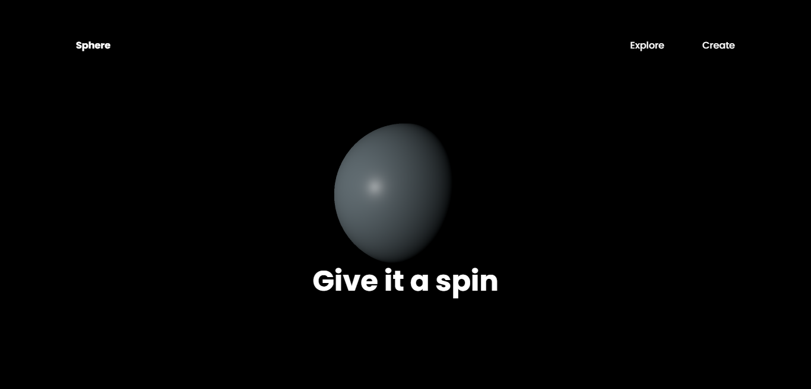

## Three.js Beginner Tutorial

This project is an implementation based on a tutorial that guides you through the process of using Three.js—a powerful library on top of WebGL for creating immersive 3D websites with minimal code.

## Table of Contents
* [Introduction](#introduction)
* [Technologies](#technologies)
* [Launch](#launch)
* [Illustrations](#illustrations)
* [Scope of Functionalities](#scope-of-functionalities)
* [Examples of Use](#examples-of-use)
* [Tutorial Source](#tutorial-source)

## Introduction
This tutorial aims to provide beginners with a foundational understanding of Three.js, a library for creating immersive 3D websites with minimal code. The potential series will delve deeper into Three.js and incorporate 3D modeling with Blender.

## Technologies
The project uses the following technologies:
- Three.js
- WebGL
- GSAP (GreenSock Animation Platform)
- Vite

## Launch
To run the project locally, follow these steps:
1. Clone this repository: `git clone https://github.com/Toufeeq1/First_Threejs_Project.git`
2. Open the project in your preferred code editor.
3. Install dependencies: `npm install`
4. Start the development server: `npm run dev`

The project will be available at [http://localhost:3000](http://localhost:3000) in your web browser.

## Illustrations

## Scope of Functionalities
The current project provides a basic example of creating a 3D sphere using Three.js. It incorporates animations using GSAP and allows for interactive color changes based on mouse movements.

## Examples of Use
Explore the provided Three.js script in `main.js` for a hands-on example of creating a 3D sphere with animation and interactive color changes.

## Tutorial Source
This project was created following a tutorial from [YouTube](https://youtu.be/_OwJV2xL8M8?si=p8viMKwj5rUvWSRs). All credit for the tutorial content goes to the original creator.

Happy coding!
